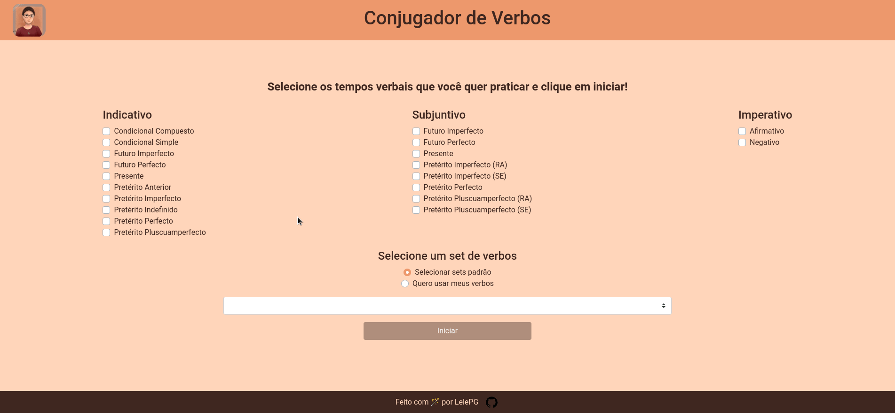
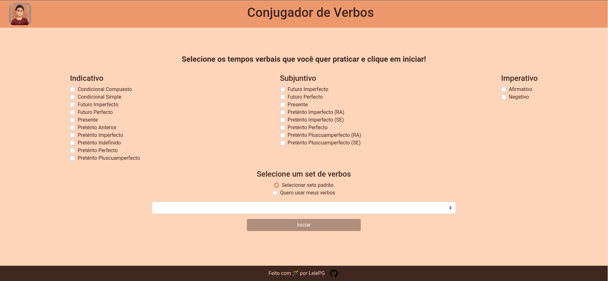

## O que é este projeto?
Este projeto é um projeto de estudos e prática de conjugação de verbos em espanhol. Ele é composto por uma tela inicial onde é possível escolher uma série de tempos verbais e verbos para praticar a conjugação, e uma tela de conjugação.

Este projeto é uma versão melhorada do projeto de conjugação de verbos que desenvolvi para estudar alemão. Esse projeto pode ser acessado [clicando aqui](https://github.com/LelePG/verben-konjugieren).

## Como usar este projeto?
Na tela de tempos verbais, você deve selecionar os tempos verbais que deseja praticar e os verbos que deseja treinar. Você pode selecionar verbos de sets específicos implementados previamente, ou digitar seus próprios verbos, separados por vírgula fazendo a seleção no input.

Uma vez selecionadas as conjugações e verbos que se deseja praticar é preciso clicar em iniciar, o que abrirá uma segunda página com bloquinhos para que o usuário digite as conjugações de um verbo escolhido no tempo mostrado na tela. Para alterar o tempo verbal, basta clicar nos botões **Anterior** e **Próximo** para navegar entre os tempos verbais escolhidos na primeira página. Clicando em **Voltar** você será recirecionado para a página inicial novamente.

É possível ver as respostas das conjugações de cada verbo clicando na lâmpada no card do verbo, e para verificar as suas respostas você pode clicar no botão de verificar também no card do verbo. Pontos serão calculados com esta verificação, e o espaço de escrita ficará colorido indicando se sua resposta está ou não correta. 

## Como utilizar este projeto?
Para utilizar este projeto, é preciso fazer o download do repositório e uma vez na pasta raís do repositório, você deve rodar o comando `npm i` para fazer a instalação e o comando `npm run serve` para executar a aplicação em um terminal. 

Isso irá executar servidor de desenvolvimento, e rodará a aplicação em uma das portas da sua máquina, que pode ser acessada através de **http://localhost:PORTA** na sua máquina, ou através de  **http://SEUIP:PORTA** na rede local. Esses endereços serão exibidos após o programa estar rodando.

## Principais dependências do projeto:
- Boostrap-Vue: biblioteca de componentes gráficos do Vue
- @jirimracek/conjugate-esp: pacote do node utilizados para realizar a conjugação dos verbos
- vue-router: necessário para montar a single-page application
- vuex: utilizado para montar o estado centralizado da aplicação.

## Links úteis
- [@jirimracek/conjugate-esp](https://github.com/jirimracek/conjugate-esp)
- [@rbmaya_art](https://www.instagram.com/rbmaya_art/) - artista responsável pelo desenho

